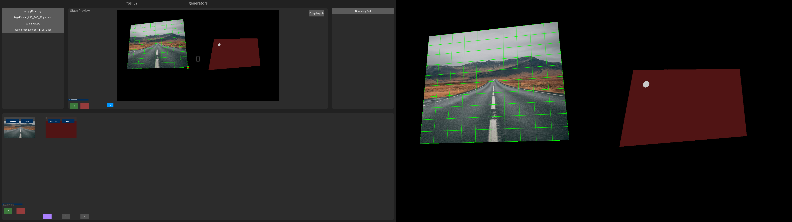

# Luna Video Mapping Library

> Professional video mapping made accessible for artists and creators


*The Luna interface - designed for artists, powered by code*

## 🎨 Made for Artists, Enhanced by Developers

Luna brings professional video mapping capabilities to Processing, with a focus on accessibility and creative expression.

### Key Features

**🎯 Artist-Friendly Interface**
- Intuitive UI designed for performers and visual artists
- No coding required for basic video mapping setups
- Real-time preview and calibration

**⚡ Generative Content Integration**
- Advanced users can create custom generative visuals
- Seamlessly integrate code-based content with video mapping
- Extend the system with your own creative algorithms

**🔧 Professional Workflow**
- Multi-scene management with smooth transitions
- Support for multiple displays and projectors
- Save and reload complex mapping setups

## Quick Start

```java
/**
 *
 * Luna Video Mapping | https://luna.art.br/
 * A Processing/Java library for Video Mapping.
 *
 * Created by Daniel Corbani
 * GPL 2.0 licence: https://www.gnu.org/licenses/old-licenses/gpl-2.0.html.en
 *
 */


/* Befor running this sketch, include all necessary media files
 *        in the data folder. The library will find them and made
 *        them available in the left panel.
 */
 
import paletai.mapping.*;

//Luna need this two complementary libraries to work
//You can install them from the Processing Contrinution Manager
import controlP5.*;
import processing.video.*;


Project project;

void setup() {
  fullScreen(P2D, SPAN); //This should always be FullScreen, P2D and SPAN
  project = new Project(this, "NewProject");  //Name your project here
}

void draw() {
  background(0);
  project.render(mouseX, mouseY);
}

// press any key to save your project
// press 'space bar' to go to next scene
void keyReleased() {
  project.keyreleased(key, keyCode);  // call method on the instance
}

void mouseDragged() {
  project.moveHoverPoint(mouseX, mouseY);  // Move hovered point while dragging
}
```

## Who is Luna For?

- **Visual Artists** creating immersive installations
- **Performers** needing real-time video mapping  
- **Educators** teaching projection mapping concepts
- **Developers** extending video mapping capabilities

## Get Started

Ready to create? [Install Luna](getting-started.md) and start mapping in minutes.

Explore [examples](examples.md) or dive into the [API reference](reference.md).